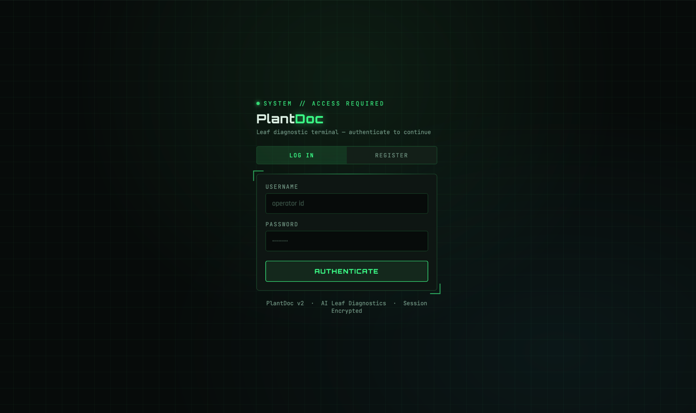
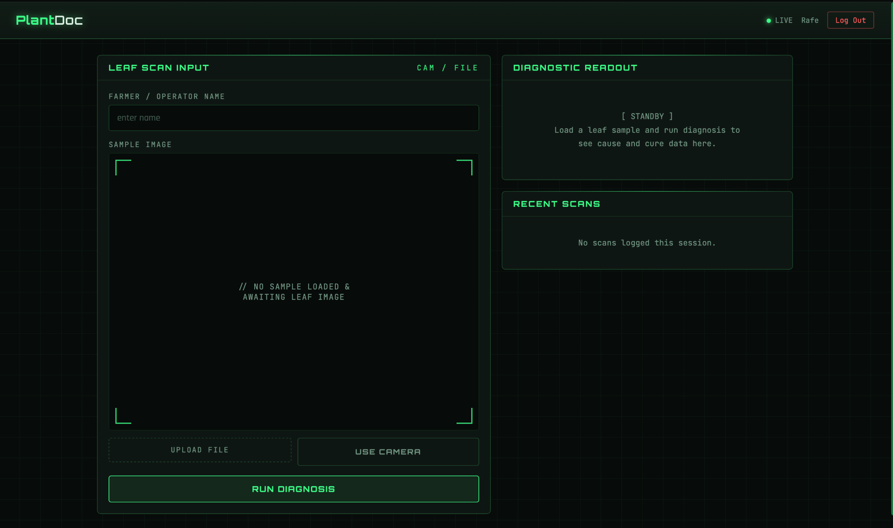
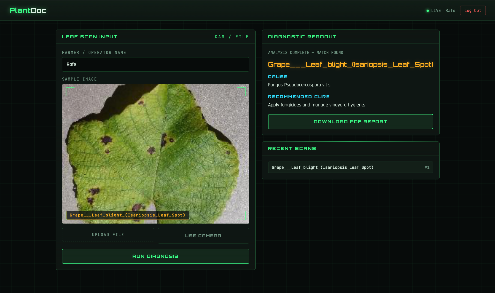

# 🌿 PlantDoc — AI Plant Disease Detection

> An AI-powered web application for detecting plant leaf diseases from images or live camera capture using **TensorFlow/Keras, EfficientNetB4, and Flask**.

[](https://www.python.org/)
[](https://flask.palletsprojects.com/)
[](https://www.tensorflow.org/)
[](https://en.wikipedia.org/wiki/Computer_vision)

## 📌 Overview

**PlantDoc** is a full-stack machine-learning project that helps identify plant diseases from leaf images. A user can upload an image or capture one using a device camera, after which the trained deep-learning model predicts the disease class and presents relevant disease information and recommended care.

The project combines **deep learning, computer vision, Python, Flask, HTML/CSS/JavaScript, and automated report generation** into a practical agriculture-focused application.

## ✨ Features

- 📷 Upload a plant-leaf image
- 🎥 Capture an image using the device camera
- 🤖 AI-based plant disease classification
- 🎯 Confidence-based handling of uncertain predictions
- 🌱 Disease cause and recommended cure information
- 👤 User registration and login
- 🕘 Recent scan history during the current session
- 📄 Generate PDF diagnostic reports
- 🔗 Generate QR codes containing report information
- 📱 Responsive web interface
- 🧩 JSON-based disease information database


## 🖥️ Demo & Screenshots

### Sample input image

The repository includes a sample plant-leaf image used to demonstrate the image-input workflow.


### Application screenshots

For the strongest portfolio presentation, add screenshots of these three application states to `docs/screenshots/`:

1. **Home / upload screen** — `home.png`
2. **Prediction result** — `prediction.png`
3. **Generated PDF report / QR result** — `report.png`

Then replace this section with:

```markdown



```

> The sample input image is included in the repository. Runtime uploads, generated reports, QR codes, and user data are intentionally excluded from Git.

## 🔗 Demo

A live deployment can be added here when the application is hosted. Until then, follow the local setup instructions above to run PlantDoc on your machine.

## 🧠 Machine Learning

The application uses a fine-tuned **EfficientNetB4** image-classification model implemented with TensorFlow/Keras.

| Item | Details |
|---|---|
| Model | EfficientNetB4 |
| Framework | TensorFlow / Keras |
| Input size | 160 × 160 pixels |
| Task | Multi-class plant disease classification |
| Model file | `plant_disease_recog_model_pwp.keras` |
| Validation accuracy | ~94.6% (initial training) |
| Post fine-tuning accuracy | ~98.7% |
| Macro precision | ~98.4% |
| Macro recall | ~98.2% |
| Macro F1-score | ~98.3% |

> **Note:** These metrics are from the project's reported validation/evaluation results. Performance on new field images can vary with lighting, camera quality, plant variety, background, and disease severity.

## 🏗️ System Workflow

```text
                    ┌─────────────────────┐
                    │      User Input      │
                    │ Upload / Camera     │
                    └──────────┬──────────┘
                               │
                               ▼
                    ┌─────────────────────┐
                    │ Image Preprocessing │
                    │ Resize → 160 × 160  │
                    └──────────┬──────────┘
                               │
                               ▼
                    ┌─────────────────────┐
                    │ EfficientNetB4      │
                    │ TensorFlow / Keras  │
                    └──────────┬──────────┘
                               │
                               ▼
                    ┌─────────────────────┐
                    │ Disease Prediction  │
                    │ + Confidence        │
                    └──────────┬──────────┘
                               │
                 ┌─────────────┴─────────────┐
                 ▼                           ▼
       ┌──────────────────┐        ┌──────────────────┐
       │ Disease Details  │        │ Diagnostic PDF   │
       │ Cause / Cure     │        │ + QR Code        │
       └──────────────────┘        └──────────────────┘
```

## 🛠️ Technology Stack

### Machine Learning
- Python
- TensorFlow
- Keras
- EfficientNetB4
- NumPy
- Pillow

### Web Application
- Flask
- HTML5
- CSS3
- JavaScript

### Reporting
- ReportLab
- QRCode generation

### Data
- JSON-based plant disease information

## 📁 Project Structure

```text
PlantDoc/
├── app.py                         # Flask application
├── plant_disease.json             # Disease information database
├── requirements.txt               # Python dependencies
├── README.md                      # Project documentation
├── .gitignore                     # Files excluded from Git
│
├── models/
│   ├── README.md                  # Model download/setup instructions
│   └── plant_disease_recog_model_pwp.keras   # Download separately
│
├── templates/
│   ├── home.html                  # Main application interface
│   └── login.html                 # Login/registration interface
│
├── static/
│   ├── css/
│   │   └── style.css              # Application styling
│   ├── js/
│   │   └── scanner.js             # Camera/scanner functionality
│   └── qrcodes/
│       └── .gitkeep
│
└── uploadimages/
    └── .gitkeep                   # Runtime upload directory
```

## 🚀 Run Locally

### 1. Clone the repository

```bash
git clone https://github.com/Mdrafeakhtar/PlantDoc.git
cd PlantDoc
```

### 2. Create a virtual environment

**macOS / Linux**

```bash
python3 -m venv .venv
source .venv/bin/activate
```

**Windows**

```powershell
python -m venv .venv
.venv\Scripts\activate
```

### 3. Install dependencies

```bash
python -m pip install --upgrade pip
pip install -r requirements.txt
```

### 4. Add the trained model

The trained model is approximately **203 MB**, so it is not stored directly in this Git repository.

Download the model from the project's model location and place it at:

```text
models/plant_disease_recog_model_pwp.keras
```

The repository's `models/README.md` contains the model setup information.

### 5. Configure the Flask secret key

**macOS / Linux**

```bash
export PLANTDOC_SECRET_KEY="replace-with-a-long-random-secret"
```

**Windows PowerShell**

```powershell
$env:PLANTDOC_SECRET_KEY="replace-with-a-long-random-secret"
```

### 6. Start PlantDoc

```bash
python app.py
```

Open the application at:

```text
http://127.0.0.1:5000
```

On first run, the application can create its local runtime user data. Local credential files are excluded from Git.

## 📊 Project Results

The model development reported the following evaluation results:

- **Initial validation accuracy:** ~94.6%
- **Post fine-tuning accuracy:** ~98.7%
- **Macro precision:** ~98.4%
- **Macro recall:** ~98.2%
- **Macro F1-score:** ~98.3%

These results demonstrate the model's performance on the project's evaluation data; they should not be interpreted as a guarantee of field-level diagnostic accuracy.

## 🔐 Security & Git Hygiene

The repository intentionally excludes runtime and sensitive files such as:

```text
users.json
.env
*.key
*.pem
__pycache__/
.venv/
```

Never commit passwords, API keys, private credentials, or personal data.

## 🔬 Future Improvements

- Deploy the application to a cloud platform
- Add more crop and disease classes
- Improve robustness using field-condition images
- Add multilingual support for farmers
- Add confidence visualization and prediction history
- Add model versioning and automated evaluation
- Add an API endpoint for mobile-app integration
- Add secure production authentication and database storage

## 🎓 Academic / Portfolio Context

PlantDoc demonstrates practical experience in:

- Deep learning and transfer learning
- Computer vision
- TensorFlow/Keras model integration
- Flask web development
- Front-end and back-end integration
- Image preprocessing and classification
- Automated PDF and QR-code generation
- Building an end-to-end machine-learning application

## 💼 Why this project is portfolio-ready

PlantDoc demonstrates an end-to-end workflow rather than only a trained model: image acquisition → preprocessing → deep-learning inference → confidence handling → disease information → report generation. It combines ML engineering with a usable web interface and application logic.

### Key skills demonstrated

`Python` `TensorFlow` `Keras` `EfficientNetB4` `Computer Vision` `Flask` `JavaScript` `HTML/CSS` `Image Classification` `Transfer Learning` `PDF Generation` `QR Codes`

## 👨‍💻 Author

**Md Rafe Akhtar**  
B.Tech — Electronics & Communication Engineering (Avionics)  
Central University of Jammu

## ⚠️ Disclaimer

PlantDoc is an educational/research project. Predictions and treatment information should be independently verified by a qualified agricultural professional before making crop-management decisions.
